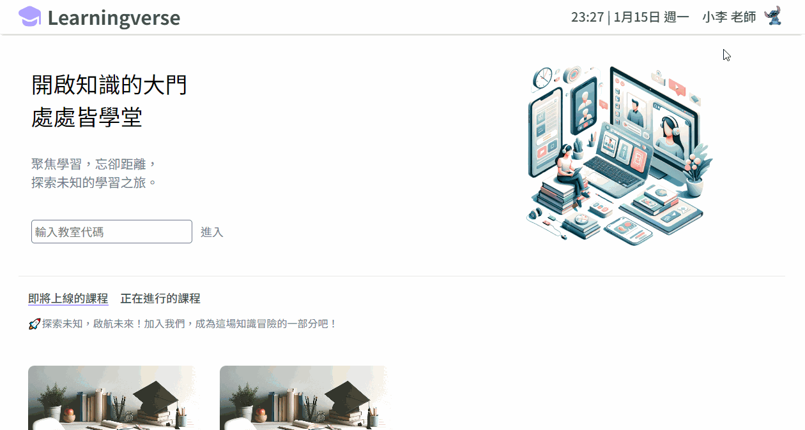

<h1 align="center"> Learningverse 🎓</h1>

 <i>"Teach Beyond Borders, Learn Without Limits: Your Virtual Classroom Journey Begins Here"</i>

👩‍🏫 Learningverse is an online learning and teaching website where teachers and students can engage in instructional activities through video conferencing rooms.

🔗 Website URL: https://learningverse.ysirene.online/

👨‍💻 Testing Account:

- Account 1 (as a teacher)

  - Email: teacher@test.com
  - password: teacher

- Account 2 (as a student)
  - Email: student@test.com
  - password: student

## Main Feature

- Authenticate user with `JWT` and implement by `Express.js middleware`.

- As a teacher, you can create your own courses.
  

- As a student, you can select or bookmark courses.
  
  

- Show class notifications on the homepage.
  

- Control access to video conference rooms based on the account identity.

  - If the user is the instructor or the student in the class, then he or she can enter the conference room directly.
  - Otherwise, the user needs to obtain permission from the instructor before entering the conference room.

- Use `Socket.IO` and `PeerJS` to achieve real-time video conferencing.
  

- Use `PeerJS` to achieve screen sharing.
  

- Use `Socket.IO` to achieve real-time text chat.
  

- Use connection pool to connect to the database.

## Architecture

## Techniques

### Backend

- Environment: Node.js / Express.js
- SSR: EJS
- Database: MySQL
- Authentication: JSON Web Token (JWT)
- WebSocket: Socket.io
- Deployment: Docker
- Web Server: Nginx
- Cloud Service (AWS):
  - EC2
  - S3, CloudFront
  - RDS
- Networking:
  - HTTPS
  - Domain Name System (DNS)
  - SSL (ZeroSSL)

### Frontend

- HTML
- CSS
- JavaScript
- AJAX
- WebRTC: PeerJS

### Tools

- Git/Github
- Eslint
- Prettier

## Database Schema

## Contact Me

😺 Ya-Shan Lee

📧 leeys2423@gmail.com
